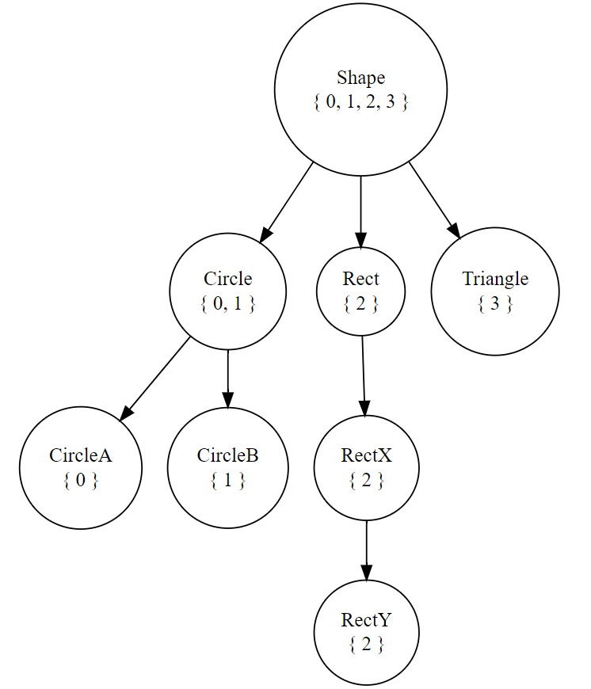

# Introduction

This crate is intended to provide a procedural macro `inheritance!` that allows user to define a set of structs with (single) inheritance relationship. It is aimed to model LLVM-like inheritance hierarchy (described in https://llvm.org/docs/HowToSetUpLLVMStyleRTTI.html) in Rust with structs and enums.

By saying "inheritance", I mean the traditional OOP-language style data inheritance, except that no virtual functions associated to the structs can be inherited (normal functions can be "inherited" through implementing `Deref` & `DerefMut`).

Besides defining derived structs containing parent's data members, this macro will also generate a set of enums describing the base struct. To be more specific, all "concrete" structs (those without child structs) within this macro will be assigned a `usize` discriminant, and the enum of a certain struct consists of all its direct & indirect concrete child structs (for a concrete struct, its enum consists a single variant).

As you may expect, you cannot extend the inheritance hierarchy outside the macro by defining more child structs, because the enum of a certain struct is determined in this macro, and thus no more variants can be added.

# Example

Using the example in `example/example.rs`, we have the following inheritance hierarchy:

The integer set below a type name means the discriminant set of this type: any `Shape` object with a discriminant within this set **is** an object of this type.

The `inheritance!` macro will generate enum names like `GenericShape`. `GenericRect`, for structs with child structs (prepending "Generic" to user-defined name); `TriangleShape`, `CircleACircle` (this name may look weird), for structs without child structs (appending parent's name to user-defined name).

By using attribute `#[repr(C, usize)]` and assign discriminants to every of its variant (which requires enabling nightly feature `arbitrary_enum_discriminant`), we make it that no matter what the inheritance hierarchy is like, there is only **one single field for discriminant** in the enum of every base class.

This has more than implications than just saving space: an **immutable** enum of a derived struct is **memory-layout compatible** with the enum of its parent struct, e.g., `&GenericRect` can be safely casted to `&GenericShape` (however, `&mut GenericRect` cannot be safely casted to `&mut GenericShape`, because it may not have enough space for holding a `GenericShape` object, i.e., `&T` is covariant and `&mut T` is invariant).

On the other hand, `&GenericShape` / `&mut GenericShape` can both be safely casted to `&GenericRect` / `&mut GenericRect`, if the `GenericShape` object is actually a `GenericRect` object (which requires run-time check).